## Lesson 2. Creating User Interfaces

In this lesson, you’re going to learn how to build NativeScript user interfaces, including markup, styling, images, and more.

To do that, this guide will walk you through building [Groceries](https://github.com/NativeScript/sample-Groceries), a groceries management app that does the following things:

- Connects to an existing RESTful service.
- Provides user registration and login.
- Lets authenticated users add and delete groceries from a list.
- Runs cross-platform (iOS and Android).

If you follow this tutorial to the end you’ll have an app that looks like this.

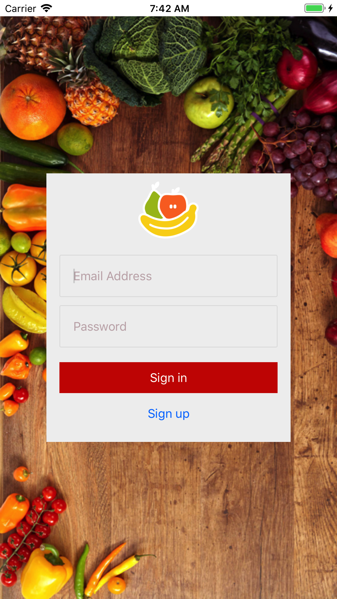
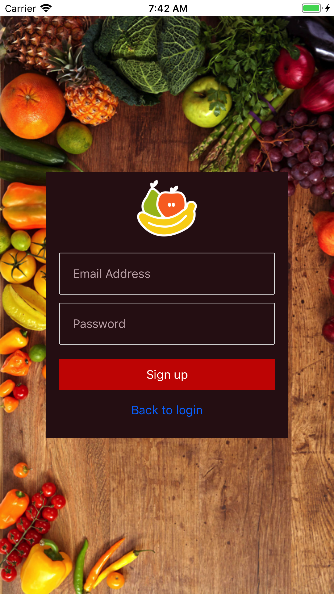
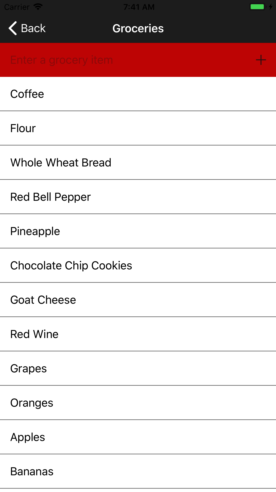
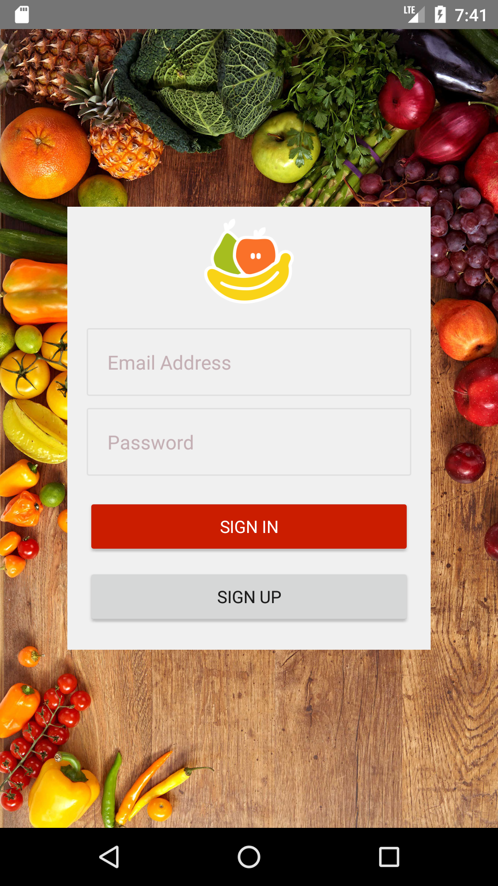
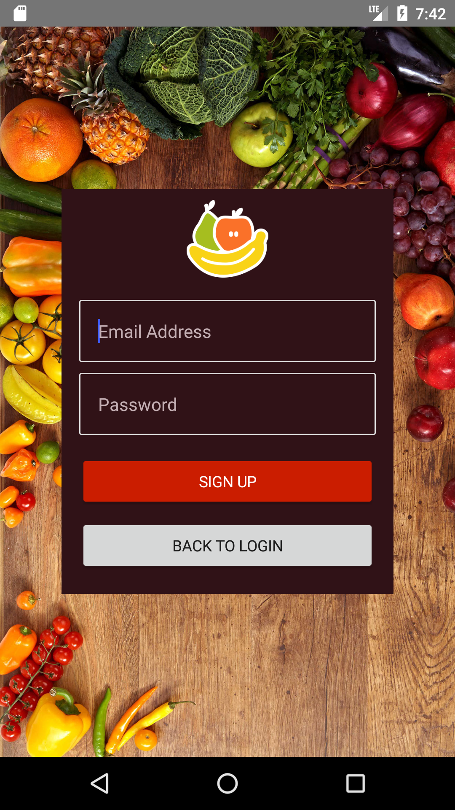
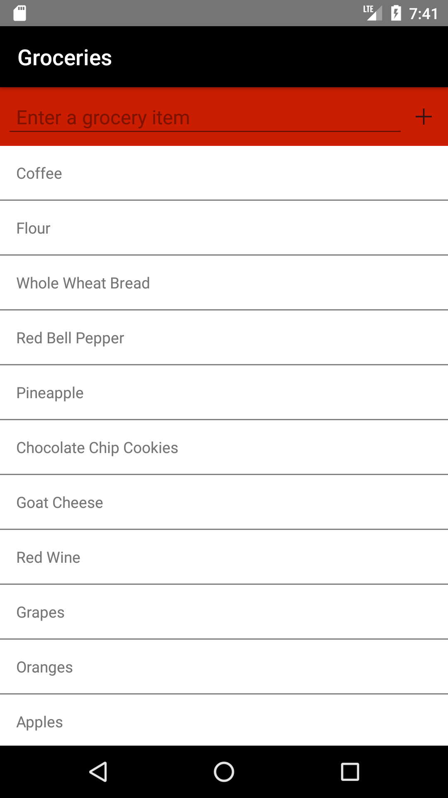

Let’s get started by looking at how to add user interface components.

### Step 1. Adding UI components

The primary difference between building an app for the web and an app with NativeScript is in the UI elements that you use. NativeScript apps do not use a browser and do not have a DOM; therefore, elements like `<div>` and `<span>` simply do not work.

Instead, NativeScript provides an [extensive suite of UI elements](http://docs.nativescript.org/ui/ui-views), each of which is implemented with native iOS and Android controls. For instance, the [`<Label>` control](http://docs.nativescript.org/ui/ui-views#label) our previous example used is actually rendered as a [`UILabel`](https://developer.apple.com/library/ios/documentation/UIKit/Reference/UILabel_Class/) on iOS and an [`android.widget.TextView`](http://developer.android.com/reference/android/widget/TextView.html) on Android. The great thing about using NativeScript is these native details are transparent to use as a developer. You type `<Label>` and let NativeScript handle the rendering details.

Let’s put this into action by adding some new UI components to start building the Groceries UI.

<hr data-action="start" />

#### Action

* **a.** Open your `app/login/login.component.html` file and paste in the following code.

``` XML
<Page>
<ActionBar title="Groceries"></ActionBar>
  <StackLayout>          
     
     <TextField <TextField hint="Email Address" keyboardType="email" autocorrect="false" autocapitalizationType="none"/>
      <TextField hint="Email Address" keyboardType="email"
            autocorrect="false" autocapitalizationType="none"/>
      <TextField hint="Password" secure="true"/>

      <Button text="Sign in"/>
      <Button text="Sign up for Groceries"/>

   </StackLayout>
</Page>
```

* **b.** Save your files using `Ctrl` + `S` or `Cmd` + `S`. You should see the following user interface on your device.

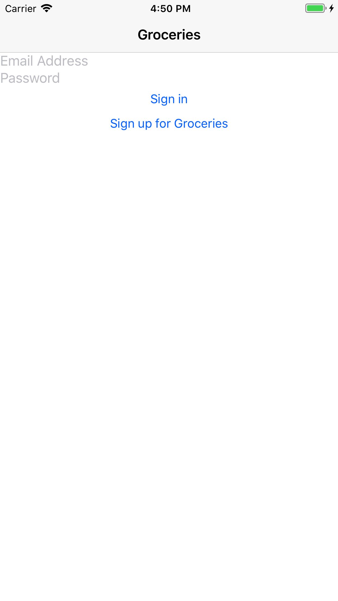


<hr data-action="end" />

> **TIP**: Throughout this tutorial you’ll see expandable **Background** sections that you can open for more information on the features you’re using. Here are a few things you might want to review before focusing on the UI components.

The code above adds two new NativeScript UI components: a [text field](https://docs.nativescript.org/angular/code-samples/ui/text-field) and a [button](https://docs.nativescript.org/angular/code-samples/ui/button). Much like HTML elements, NativeScript UI components provide attributes to let you configure their behavior and appearance. The code you just added uses the following attributes:

- `<TextField>`
    - `hint`: Shows placeholder text that tells the user what to type.
    - `keyboardType`: The type of keyboard to present to the user for input. `keyboardType="email"` shows a keyboard optimized for entering email addresses. NativeScript currently supports [five types of keyboards](http://docs.nativescript.org/ui/keyboard.html) for text fields.
    - `autocorrect`: A boolean attribute that determines whether the mobile operating system should autocorrect user input. In the case of email address text fields, the autocorrect behavior is undesirable.
    - `autocapitalizationType`: Determines how the operating system should autocapitalize user input. `autocapitalizationType="none"` turns autocapitalization off altogether. NativeScript supports [four autocapitalization types](http://docs.nativescript.org/api-reference/modules/_ui_enums_.autocapitalizationtype.html) on text fields.
    - `secure`: A boolean attribute that determines whether the text field’s text should be masked, which is commonly done on password fields.
- `<Button>`
    - `text`: Controls the text displayed within the button.

There are [many UI components](https://docs.nativescript.org/angular/ui/components) you can use to build NativeScript apps, and you might want to take some time to explore all that’s out there.

Next, let’s focus on the other new UI component in the above example—`<StackLayout>`—and discuss how to organize your UI components in NativeScript apps.

> **TIP**:
> * If you’re coming from a web or hybrid development background, you may find Nic Raboy’s guide for [Upgrading Hybrid Apps to Native with NativeScript](http://www.hybridtonative.com/) helpful, as it compares and contrasts web and native user interface implementations.

### Step 2. Organizing your UI with layouts

Because NativeScript does not use a browser to render UI components, web layout concepts like `display: block` and `display: inline` do work in NativeScript apps.

Instead, NativeScript provides several different layout UI components that allow you to position your components using native Android and iOS layout mechanisms. Although there are [several layout containers in NativeScript](https://docs.nativescript.org/angular/ui/layout-containers), there are three you’ll primarily use.

* The [`<StackLayout>`](https://docs.nativescript.org/angular/code-samples/ui/layouts#stack-layout) lets you stack child UI elements either vertically or horizontally.
* The [`<GridLayout>`](https://docs.nativescript.org/angular/code-samples/ui/layouts#grid-layout) lets you divide your interface into a series of rows and columns, much like a `<table>` in HTML markup.
* The [`<FlexboxLayout>`](https://docs.nativescript.org/angular/code-samples/ui/layouts#flexbox-layout-one) lets you arrange UI components using the syntax as `display: flex` on web.

Let’s add one more layout example to your app and then discuss how all this works.

<hr data-action="start" />

#### Action

* **a.** Open your `app/login/login.component.html` file and replaces its contents with the following code, which adds a new `<FlexboxLayout>` component.

``` XML
<Page>
<ActionBar title="Groceries"></ActionBar>
	<FlexboxLayout>
	  <StackLayout>          
	     
	     <TextField <TextField hint="Email Address" keyboardType="email" autocorrect="false" autocapitalizationType="none"/>
	      <TextField hint="Email Address" keyboardType="email"
	            autocorrect="false" autocapitalizationType="none"/>
	      <TextField hint="Password" secure="true"/>
	
	      <Button text="Sign in"/>
	      <Button text="Sign up for Groceries"/>
	
	   </StackLayout>
	 </FlexboxLayout>
</Page>
```

* **b.** Save your files. When your app refreshes with the change you should see the following on your device.


<hr data-action="end" />

Let’s break down what’s happening in this example, starting with the `<StackLayout>` component. The `<StackLayout>` is the simplest NativeScript layout, as all it does is stack user interface components—vertically by default, and horizontally if you give the component a `orientation="horizontal"` attribute. In this example, the `<StackLayout>` is why the two `<TextField>` and `<Button>` components are verically stacked.

The other layout component in this example is the `<FlexboxLayout>` control. With a `<FlexboxLayout>` you have the ability to align components using the same flexbox syntax you would use to align `<div>` in a web app. Flexbox is commonly used for vertical centering, and that’s exactly what you’re going to use it for in this tutorial.

Your next step will be centering the `<StackLayout>` using flexbox syntax, but to do that you’ll need to learn a new NativeScript concept—CSS.

> **TIP:** Learning NativeScript layouts can be tricky, especially if you come from a web development background. Reading the [documentation](https://docs.nativescript.org/ui/layouts) is a good place to start.

### Step 3. Styling your app using CSS

NativeScript uses a [subset of CSS](http://docs.nativescript.org/styling) to change the visual appearance of your UI components.

Why a subset? In NativeScript you’re building native iOS and Android apps, and some CSS properties either aren’t possible to replicate with native iOS and Android APIs, or would incur too great of a performance penalty. Don’t worry though; most common CSS properties are supported, and the CSS language syntax is the same—so styling native apps in NativeScript really does feel like styling web apps.

> **TIP**: The NativeScript docs have [a full list of the supported CSS properties you can use](http://docs.nativescript.org/ui/styling#supported-css-properties).

Let’s look at how CSS in NativeScript works, and start to make this Groceries app look good in the process.

<hr data-action="start" />

#### Action

* **a.** Open your app’s `app/views/login/login.css` file and paste in the following code.

``` CSS
FlexboxLayout {
  justify-content: center;
  align-items: center;
  background-size: cover;
  background-image: url("~/images/background.jpg");
}
StackLayout {
  width: 300;
  padding: 10 16;
  background-color: #f0f0f0;
}
```

* **b.** Save the file. You should see the following display on your device.


<hr data-action="end" />

If you've done any web development before, the syntax should feel familiar here. You select two UI components by their tag names (`FlexboxLayout` and `StackLayout`), and then apply a handful of CSS rules as name/value pairs.

Specifically, in the case of the `FlexboxLayout`, you apply a `justify-content: center` rule to align the child `StackLayout` horizontally, and a `align-items: center` rule to align that same `StackLayout` vertically. This is why the `StackLayout` now appears centered in the middle of the screen.

You’re using a few other CSS properties in this example as well, such as `width`, `padding` and `background-color`, and you’ll use several additional properties as you complete this tutorial.

With this latest change the Groceries app is starting to look more like a real app, but it could certainly use some design help. To help make this app better let’s move on to the next step of this tutorial, and talk about the NativeScript Core theme.

#### Background: Learning flexbox

Flebox syntax can be tricky to learn, regardless of whether you’re using flexbox on the web or in NativeScript apps. Here are two good learning resources.

* **CSS Tricks**: The [Complete Guide to Flexbox](https://css-tricks.com/snippets/css/a-guide-to-flexbox/) on CSS Tricks is an excellent reference for working with flexbox’s many properties and values. Bookmark the page and refer to it when you’re configuring your layouts.
* **Flexbox Froggy**: [Flexbox Froggy](http://flexboxfroggy.com/) in an in-browser game for learning flexbox by moving a frog around the screen. If you’re new to flexbox it’s a great tutorial for learning how the values flexbox properties work.

#### End Background

### Step 4. Using the NativeScript Core theme

NativeScript’s styling infrastructure makes it possible to create and use CSS themes for your native applications, much like you would use a framework like Bootstrap on the web.

The NativeScript project provides a [core theme](https://docs.nativescript.org/ui/theme) that you can add to any of your projects. The theme includes two color schemes, light and dark, as well as a series of convenience class names to help you build elegant user interfaces quickly. Let’s look at how to add the Core theme to Groceries, and how to use it to make your login screen look good.

<hr data-action="start" />

#### Action

* **a.** Open your `app/app.css` file and paste in the following code, which imports the NativeScript Core theme’s default stylesheet.

``` CSS
@import "nativescript-theme-core/css/core.light.css";

ActionBar {
  background-color: black;
  color: white;
}
```
> **TIP**:
> * In NativeScript, the `app.css` is a global stylesheet. Any rules you apply in `app.css` apply to all components in your app.
> * Don’t worry about the new `<ActionBar>` rules for now. You’ll learn more about `<ActionBar>`s later in this guide.

* **b.** Open your `app/views/login/login.xml` file and replace its contents with the following code, which adds a new `class` attribute to several of the UI components.

* **c.** Open your `app/views/login/login.css` file, and add the following CSS code under the existing selectors.

``` CSS
Image {
  margin-bottom: 20;
  height: 70;
}
Button, TextField {
  margin-bottom: 10;
}
.btn-primary {
  background-color: #CB1D00;
  margin-left: 0;
  margin-right: 0;
}
TextField {
  placeholder-color: #C4AFB4;
  color: black;
}
```
* **d.** Save your files. You should see the following UI on your device.

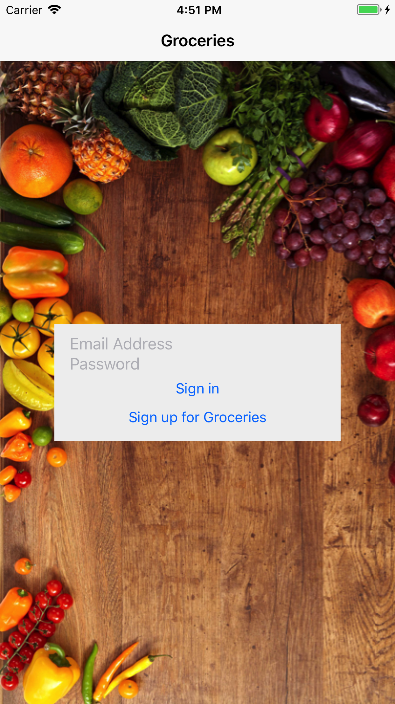
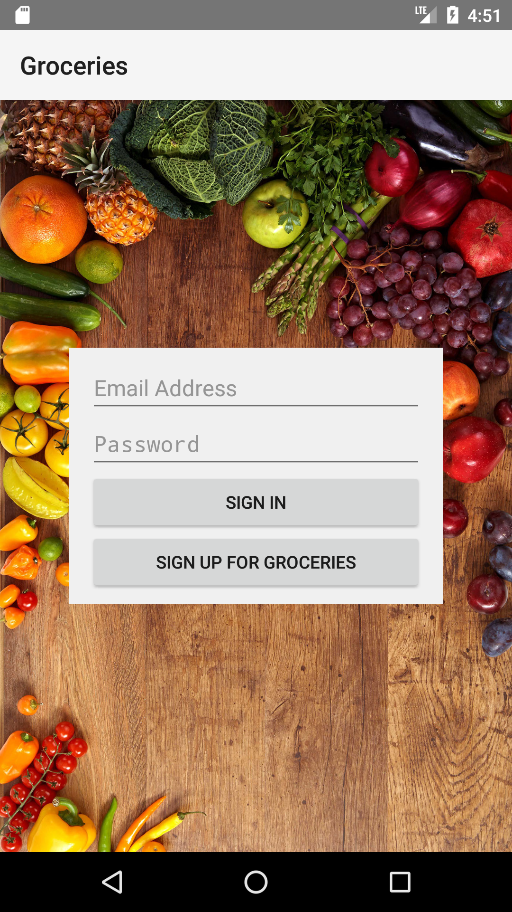

<hr data-action="end" />

The first thing to note here are the class names `form`, `input`, `input-border`, `btn`, and `btn-primary`. These are all class names from the NativeScript Core Theme, and each apply a set of CSS rules to help your UI components look good by default.

> **NOTE**: Refer to the [NativeScript Core theme documentation](https://docs.nativescript.org/ui/theme) for a full list of theme class names and how to use them in your apps.

One other thing to note before we move on—NativeScript’s CSS implementation allows you to select CSS rules by class names much like you do in web apps. In this example you use a `.btn-primary` selector to alter the app’s main button background color.

> **NOTE** Remember that under the hood you’re not making DOM changes here, you’re actually altering the display of completely native controls with CSS syntax. Pretty cool, huh?

Let’s look at how you can make one last change to the appearance of this page.

### Step 5. Working with images in your app

In NativeScript you use the `<Image>` UI element and its `src` attribute to add images to your pages. The `src` attribute lets you specify your image in three ways. The first (and simplest) way is to point at the URL of an image:

``` XML
<Image src="https://www.nativescript.org/images/default-source/landingpages/logo.png"/>
```

The second way is to point at an image that lives within your app's `app` folder. For example if you have an image at `app/images/logo.png`, you can use it with:

``` XML
<Image src="~/images/logo.png"/>
```

The third way is to use platform-specific image resources, which you can [learn more about on the NativeScript documentation](https://docs.nativescript.org/ui/images#load-images-from-a-resource). Let’s add a logo images to the Groceries app so you can see how this works.

<hr data-action="start" />

#### Action

* **a.** Open your app’s `app/views/login/login.html` file, and replace the code currently there with the following code, which adds a new `<Image>` component.

``` XML
<Page>
<ActionBar title="Groceries"></ActionBar>
  <FlexboxLayout>
  <StackLayout class="form">
    <Image src="~/images/logo.png"/>

    <TextField hint="Email Address" keyboardType="email"
      autocorrect="false" autocapitalizationType="none"
      class="input input-border"/>
    <TextField hint="Password" secure="true"
      class="input input-border"/>

    <Button text="Sign in" class="btn btn-primary"/>
    <Button text="Sign up for Groceries"/>
  </StackLayout>
</FlexboxLayout>
</Page>
```

* **b.** Save your files. You should see the following new image on your device.

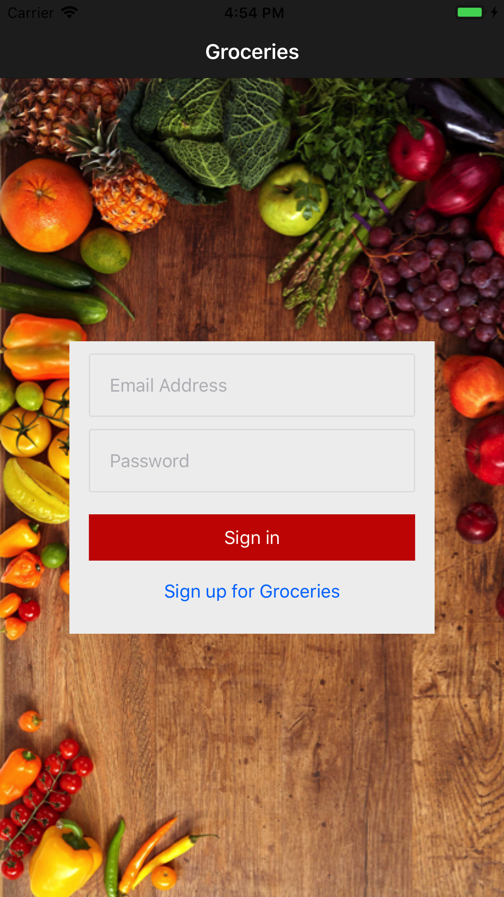
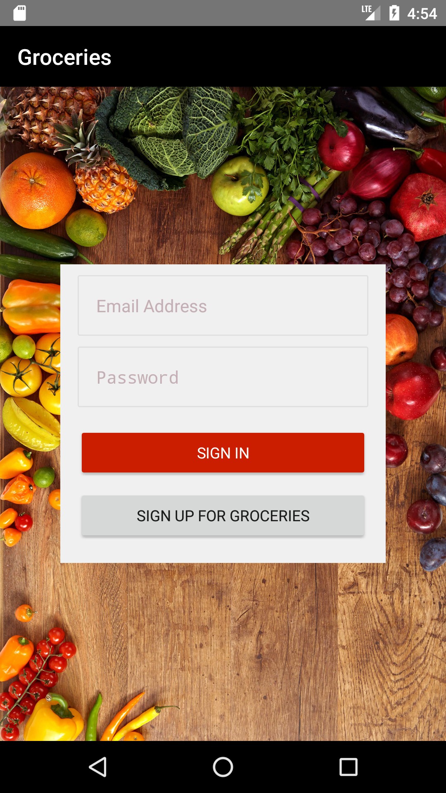

<hr data-action="end />

With this step done, the UI for your login page is mostly complete. In this lesson you learned how to use NativeScript UI components, how to configure them with attributes, and how to style them CSS. You’ve learned how to use class names from the NativeScript Core theme, as well as how to add images to your apps.

In the next lesson you’ll make the form functional, and in the process, learn a lot more about how NativeScript works.
